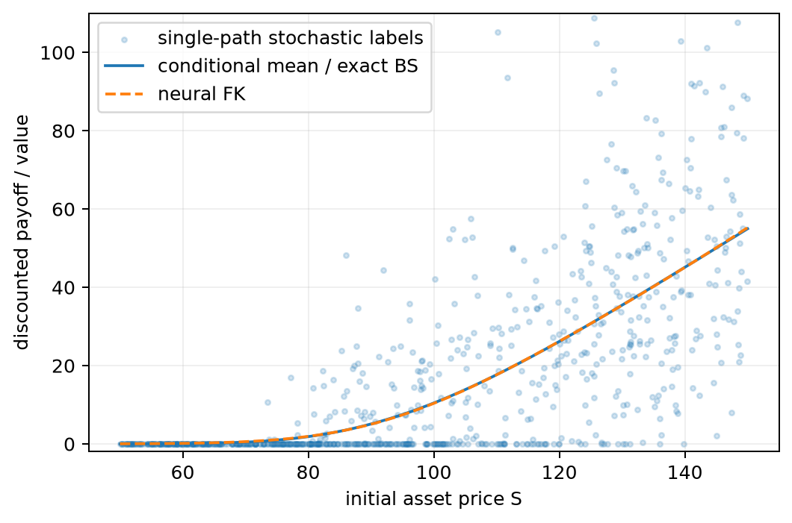
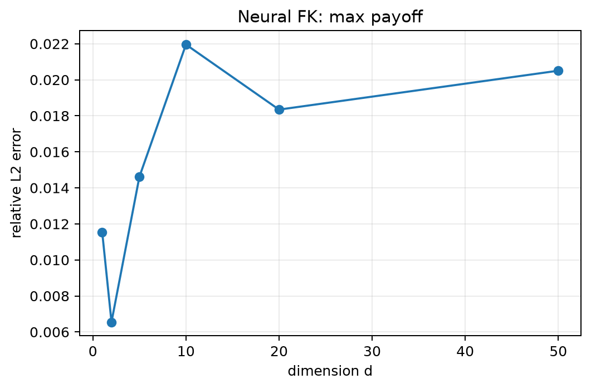

# Deep Learning Approximation of Kolmogorov PDEs

An independent numerical machine-learning project connecting stochastic differential equations, Feynman–Kac representations, Monte Carlo, finite differences, and neural conditional-expectation regression.

## Project question

For the risk-neutral geometric Brownian motion

\[
dS_t=rS_t\,dt+\sigma S_t\,dW_t,
\]

the Black–Scholes call value is

\[
V(0,S)=e^{-rT}\,\mathbb E[(S_T-K)^+\mid S_0=S].
\]

Instead of estimating this expectation separately at every initial state, the project samples initial conditions and stochastic terminal payoffs, then fits a neural network by squared loss. The population minimizer is the conditional expectation, so the network learns an amortized approximation of the whole solution surface.

## Main findings

| Experiment | Reference result |
|---|---:|
| Euler–Maruyama strong-order slope | 0.507 |
| Euler–Maruyama weak-order slopes | 0.998 and 0.996 |
| Monte Carlo RMSE slope | -0.500 |
| Crank–Nicolson MAE on \(S\in[50,150]\) | \(9.53\times10^{-4}\) |
| One-dimensional neural relative \(L^2\) error | 0.337% |
| 50D basket neural relative \(L^2\) error | 1.28% |
| 50D max-call neural relative \(L^2\) error | 2.05% |

The results support a deliberately qualified conclusion: classical finite differences remain preferable for this one-dimensional benchmark, while neural Feynman–Kac regression becomes useful as an amortized solution-map approximation when repeated queries and higher-dimensional state spaces make tensor grids impractical.





## What is implemented

1. **SDE discretization** — Euler–Maruyama versus exact GBM, with coupled strong and moment-based weak convergence checks.
2. **Feynman–Kac Monte Carlo** — pointwise pricing, confidence intervals, antithetic sampling, and empirical \(N^{-1/2}\) convergence.
3. **Finite differences** — an explicit stability demonstration and a Crank–Nicolson Black–Scholes solver.
4. **Neural Feynman–Kac** — online stochastic labels and an MLP approximation of \(S\mapsto V(0,S)\).
5. **High-dimensional scaling** — arithmetic-basket and max-call payoffs for \(d=1,2,5,10,20,50\), including accuracy and amortized runtime comparisons.

## Repository layout

```text
Kolmogorov-Deep-Learning/
├── notebooks/
│   ├── 01_sde_simulation.ipynb
│   ├── 02_monte_carlo.ipynb
│   ├── 03_black_scholes_pde.ipynb
│   ├── 04_neural_feynman_kac.ipynb
│   └── 05_high_dimensional_basket.ipynb
├── src/
│   ├── sde.py
│   ├── monte_carlo.py
│   ├── finite_difference.py
│   ├── neural_solver.py
│   └── payoffs.py
├── tests/test_core.py
├── figures/
├── results/
├── report/
├── run_experiments.py
└── requirements.txt
```

## Reproduce

```bash
python -m venv .venv
source .venv/bin/activate
python -m pip install -r requirements.txt
pytest -q
python run_experiments.py
```

The full experiment regenerates the numerical tables, figures, and neural checkpoint. Reference seeds are fixed in `run_experiments.py`; neural timings and small floating-point differences may vary across hardware and library versions.

The notebooks provide shorter interactive views of each task:

```bash
jupyter lab
```

## Reports

- [Detailed numerical report](report/report.md)
- [Standalone research-style report](report/mini_research_report.md)

## Numerical design choices

- Exact GBM transitions isolate Monte Carlo and neural-regression error from time-discretization error.
- Strong convergence couples Euler–Maruyama and exact GBM on the same Brownian paths.
- Weak convergence uses exact moments of the Euler discretization, avoiding a Monte Carlo noise floor.
- High-dimensional neural labels use antithetic sampling; reference values use scrambled Sobol integration.
- Neural-versus-Monte-Carlo runtime is treated as an amortization question, not as a claim that a trained network is cheaper than a single Monte Carlo price.
- High-dimensional results are controlled numerical examples, not evidence of dimension-independent complexity.

## References

- C. Beck, S. Becker, P. Grohs, N. Jaafari, and A. Jentzen, *Solving the Kolmogorov PDE by means of deep learning*, Journal of Scientific Computing 88 (2021); arXiv:1806.00421.
- F. Black and M. Scholes, *The Pricing of Options and Corporate Liabilities*, Journal of Political Economy 81(3), 1973.
